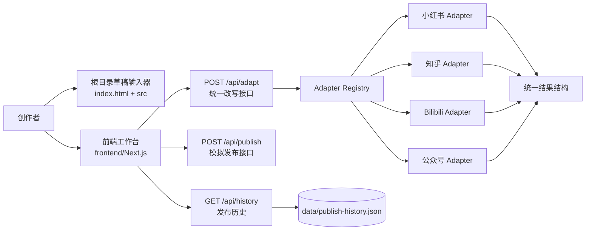

# CreatorSync

CreatorSync 是一个面向内容创作者、品牌运营和新媒体团队的多平台内容发布助手。项目目标是把“一份原始草稿”整理为可复用的统一输入，并通过平台适配器生成适合小红书、知乎、Bilibili、微信公众号等渠道的结构化版本，最终支持预览、确认、模拟发布与发布历史追踪。

本仓库当前以本地可运行 Demo 为主：前端提供内容输入、平台目标配置、模拟发布工作台和发布历史展示；后端提供 Express + TypeScript API、平台 Adapter、统一改写接口、mock publish 和本地 JSON 历史存储。当前阶段不依赖真实第三方发布平台，也不要求配置真实 AI Key；没有 `OPENAI_API_KEY` 时会使用确定性的 mock fallback，便于评审复现。

## 用户痛点

- **多平台重复改写成本高**：同一篇内容在小红书、知乎、Bilibili、公众号上的标题长度、语气、结构和标签要求不同，人工改写耗时且难以保持一致。
- **发布前缺少统一预览**：创作者往往在多个平台后台之间切换，难以从一个视图比较不同平台版本。
- **平台差异容易污染主流程**：如果把平台规则写在页面或业务流程中，后续新增平台会影响原有功能。
- **演示与本地复现门槛高**：真实平台 API、AI Key 和发布权限都可能影响评审体验，因此本项目提供 mock fallback 与本地历史文件。

## 核心功能

| 功能 | 当前状态 | 说明 |
| --- | --- | --- |
| 本地草稿输入 | 已实现 | 根目录轻量页面可保存标题、正文与标签到浏览器 localStorage。 |
| 平台目标配置 | 已实现 | 前端可选择目标平台并维护 tone、length、format 等目标配置。 |
| 统一改写 API | 已实现 | `POST /api/adapt` 接收一份 draft 和多个 platforms，返回统一结构的多平台结果。 |
| Platform Adapter | 已实现 | 后端已注册小红书、知乎、Bilibili、微信公众号 Adapter。 |
| mock fallback | 已实现 | 无 AI Key 时使用确定性平台规则生成结果，保证本地可复现。 |
| 模拟发布 | 已实现 | 前端调用 `POST /api/publish` 创建 mock publish task，可模拟成功与失败。 |
| 发布历史 | 已实现 | 后端提供本地 JSON 历史读取与导出模块，便于后续接入改写/发布记录持久化。 |
| 真实平台发布 | 未实现 | 当前只做 mock publish，真实平台鉴权、审核、发布 API 属未来扩展。 |

## 架构设计

CreatorSync 使用 npm workspaces 管理前端与后端，并保留一个根目录轻量页面用于最小草稿输入 Demo。



### 数据流

1. 用户在前端输入原始标题、正文、标签，并选择一个或多个目标平台。
2. 前端将统一 draft、platforms 和可选 targetConfig 提交给后端 `POST /api/adapt`。
3. 后端加载公共 prompt 模板和平台 prompt 模板，构造平台上下文。
4. Adapter Registry 按平台 ID 找到具体 Adapter，并调用统一 `adapt(input)` 方法。
5. 每个 Adapter 返回 `{ platform, status, content, warnings, metadata }` 结构。
6. 前端用统一结果渲染平台预览；用户可继续触发 mock publish。
7. 发布历史模块从本地 `data/publish-history.json` 读取记录并支持导出；后续接入真实发布后可复用该模块记录任务结果。

### 模块说明

| 模块 | 路径 | 职责 |
| --- | --- | --- |
| 根目录轻量 Demo | `index.html`, `src/` | 演示统一草稿输入、本地保存与标签规范化。 |
| 前端工作台 | `frontend/app`, `frontend/components` | Next.js UI，展示模拟发布工作台、状态栏、发布历史和布局。 |
| 前端目标配置 Demo | `frontend/src` | 原生 JS 版本的平台选择、目标配置、本地存储和接口调用逻辑。 |
| 后端 API | `backend/src/routes` | 健康检查、Adapter 发现、统一改写、mock 发布、历史查询与导出。 |
| Adapter 层 | `backend/src/adapters` | 封装平台差异，输出统一结构，避免平台规则散落在主流程。 |
| 改写服务 | `backend/src/services/adaptation-service.ts` | 组装 prompt 上下文、调度 Adapter、返回多平台结果。 |
| 历史存储 | `backend/src/history.ts` | 使用本地 JSON 文件读取、保存和导出发布历史，供历史 API 复用。 |
| Prompt 模板 | `prompts/` | 存放统一改写流程使用的系统模板和平台模板。 |
| 文档 | `docs/` | 记录项目概览、环境变量、开发规范和来源说明。 |

## Platform Adapter 说明

Platform Adapter 是本项目的核心扩展点。它把“统一草稿输入”和“平台差异规则”隔离开：主流程只关心 draft 和统一结果，平台规则由各 Adapter 负责。

### 统一输入

```json
{
  "title": "内容标题",
  "body": "原始正文",
  "summary": "可选摘要",
  "tags": ["内容发布", "AI工具"],
  "assets": [],
  "metadata": {
    "targetConfig": {}
  }
}
```

### 统一输出

```json
{
  "platform": "xiaohongshu",
  "status": "ready",
  "content": {
    "title": "平台标题",
    "body": "平台正文",
    "summary": "平台摘要",
    "tags": ["内容发布"],
    "assets": [],
    "platformFields": {}
  },
  "warnings": [],
  "metadata": {
    "adapterName": "XiaohongshuContentAdapter",
    "generatedAt": "2026-05-30T00:00:00.000Z",
    "capabilities": []
  }
}
```

### 已接入 Adapter

| Adapter | 平台定位 | 原创规则边界 | 外部依赖边界 |
| --- | --- | --- | --- |
| Xiaohongshu | 种草笔记、短标题、标签化表达 | 项目内编写的情绪化标题、短段落和标签规则 | 不调用小红书官方 API；不使用外部文案模板 |
| Zhihu | 问答/分析型长文 | 项目内编写的问题拆解、论证结构和结论提示 | 不调用知乎官方 API；不抓取知乎内容 |
| Bilibili | 视频简介、动态、互动引导 | 项目内编写的口语化 Hook、互动问题和社区语气 | 不调用 Bilibili 官方 API；不复用外部脚本 |
| WeChat Official Account | 公众号图文、摘要、CTA | 项目内编写的长文结构、摘要和行动提示 | 不调用微信公众平台 API；不复用外部模板 |

## 依赖清单

### 运行环境

| 依赖 | 版本要求/当前版本 | 用途 |
| --- | --- | --- |
| Node.js | `>=20.0.0` | 运行 npm workspaces、Next.js、Express 与测试脚本。 |
| npm | `>=10.0.0` | 安装依赖并运行 workspace scripts。 |

### 根目录 workspace

| 依赖 | 用途 |
| --- | --- |
| npm workspaces | 统一管理 `frontend` 与 `backend` 子包。 |
| Node 内置 `node:test` / `node:assert` | 根目录草稿存储单元测试使用，无需额外安装测试框架。 |

### Frontend

| 第三方库/框架 | 当前声明版本 | 用途 |
| --- | --- | --- |
| Next.js | `^15.3.4` | 前端 App Router 页面、开发服务器、构建和运行。 |
| React | `^19.0.0` | 前端组件与状态渲染。 |
| React DOM | `^19.0.0` | React 浏览器端渲染。 |
| TypeScript | `^5.8.3` | 前端类型检查。 |
| Tailwind CSS | `^3.4.17` | 前端样式系统和工具类。 |
| PostCSS | `^8.5.6` | Tailwind 构建链路。 |
| Autoprefixer | `^10.4.21` | CSS 浏览器前缀处理。 |
| `@types/node` | `^22.15.29` | Node 类型声明。 |
| `@types/react` | `^19.0.12` | React 类型声明。 |
| `@types/react-dom` | `^19.0.4` | React DOM 类型声明。 |

### Backend

| 第三方库/框架 | 当前声明版本 | 用途 |
| --- | --- | --- |
| Express | `4.21.2` | HTTP API 服务、路由和中间件。 |
| cors | `2.8.5` | 开发环境跨域访问控制。 |
| dotenv | `16.4.7` | 加载后端本地环境变量。 |
| TypeScript | `5.7.2` | 后端类型检查与构建。 |
| ts-node-dev | `2.0.0` | 后端本地开发热重载。 |

### 未接入的外部能力

- 当前未接入真实 AI SDK；`OPENAI_API_KEY` 和 `OPENAI_MODEL` 仅作为未来 AI 集成预留环境变量。
- 当前未接入小红书、知乎、Bilibili、微信公众平台的真实发布 API。
- 当前发布历史使用本地 JSON 文件，不依赖数据库、对象存储或云服务。

## 原创功能说明

### 项目原创设计

- 多平台内容发布助手的产品流程：统一草稿 → 平台选择 → Adapter 改写 → 预览/确认 → mock publish → 发布历史。
- Platform Adapter 接口、Adapter Registry、统一输入/输出结构和能力描述机制。
- 各平台 mock fallback 改写规则、警告规则、结构化字段和演示文案。
- 前端工作台的信息架构、模拟发布状态展示和发布历史展示。
- 本地 JSON 发布历史读取、保存辅助函数与 Markdown/JSON 导出思路。
- README、架构图、数据流、依赖边界和原创性说明文档。

### 外部依赖提供的能力

- Next.js、React 和 Tailwind CSS 只提供前端渲染、开发构建和样式基础设施。
- Express、cors 和 dotenv 只提供 HTTP 服务、跨域与环境变量加载能力。
- TypeScript 只提供类型检查与编译能力。
- Node.js 内置模块只提供文件系统、路径、测试和断言等基础能力。

### 原创与依赖边界

CreatorSync 的业务价值不来自第三方库的现成业务功能，而来自项目内定义的多平台发布工作流、Adapter 抽象、平台差异规则、统一 API contract 和可复现 Demo。第三方库负责基础工程能力；平台策略、接口结构、演示流程和文档解释均为本仓库原创设计。

## 代码来源说明

本 PR 未复用个人旧项目代码、旧模板或旧 prompt。现有业务代码、Adapter 规则、mock fallback 文案、接口结构和文档结构均围绕 CreatorSync 当前产品目标在本仓库内编写。

详细来源与边界说明见 [`docs/source-notes.md`](docs/source-notes.md)。如果后续 PR 引入历史代码、外部模板或第三方 prompt，必须同时更新 README 与 `docs/source-notes.md`，写明来源、授权状态和改造点。

## 运行方式

### 1. 安装依赖

```bash
npm install
```

### 2. 准备环境变量

```bash
cp .env.example .env
cp backend/.env.example backend/.env
```

建议后端本地端口使用 `3001`，前端默认 `NEXT_PUBLIC_API_BASE_URL=http://localhost:3001`。如果需要改为其他端口，请同步调整后端 `PORT` 和前端 `NEXT_PUBLIC_API_BASE_URL`。

### 3. 启动后端

```bash
npm run dev --workspace backend
```

后端默认监听 `PORT`，未设置时回退到 `3001`。常用接口：

- `GET /health`
- `GET /adapters`
- `POST /api/adapt`
- `POST /api/publish`
- `GET /api/history`

### 4. 启动前端

```bash
npm run dev --workspace frontend
```

Next.js 默认运行在 `http://localhost:3000`。请确保 `NEXT_PUBLIC_API_BASE_URL` 指向后端地址。

### 5. 启动所有 workspace（可选）

```bash
npm run dev
```

该命令会并行运行各 workspace 中存在的 `dev` script。

### 6. 根目录轻量草稿 Demo（可选）

可直接用浏览器打开 `index.html`，用于查看最小草稿输入、本地保存和标签规范化效果。该页面不依赖后端服务。

## 测试方式

```bash
npm test
```

运行 workspace 中声明的测试脚本；当前子包未统一声明 `test` script 时，该命令会跳过不存在的测试脚本。

```bash
node --test test/draftStorage.test.js
```

运行根目录草稿存储单元测试。

```bash
node frontend/tests/targetConfig.test.js
```

运行前端目标配置纯函数测试。

```bash
npm run typecheck
```

运行 workspace 类型检查，覆盖前端与后端 TypeScript 代码。

```bash
npm run build
```

运行 workspace 构建，验证前后端能否完成生产构建。

## Demo 链接

- Demo 视频链接：`TODO: 在提交评审前替换为正式视频链接`
- 本地前端 Demo：`http://localhost:3000`
- 后端健康检查：`http://localhost:3001/health`
- 根目录轻量 Demo：打开 `index.html`

建议正式 Demo 视频覆盖以下流程：

1. 输入统一草稿并选择目标平台。
2. 调用后端生成多平台结构化结果。
3. 展示 Adapter 输出差异和 mock fallback 的可复现性。
4. 执行一键模拟发布和模拟失败。
5. 查看发布历史与导出能力。

## 未来扩展方向

- 接入真实 AI Provider，并保留 mock fallback 作为评审和离线演示模式。
- 增加真实平台 OAuth、草稿箱、发布、回执和失败重试能力。
- 为 Adapter 增加平台约束校验，例如标题长度、标签数量、图片规格和敏感词提示。
- 增加用户账号、团队空间、内容版本管理和审批流。
- 将本地 JSON 历史存储替换为数据库，并增加分页、搜索和审计日志。
- 增加端到端测试、API contract 测试和截图型回归测试。
