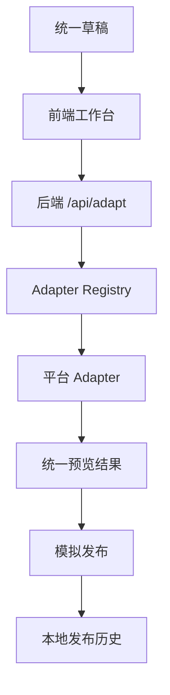

# CreatorSync 项目概览

CreatorSync 是面向创作者、品牌运营和新媒体团队的多平台内容发布助手。项目通过统一草稿、平台目标配置、Platform Adapter、模拟发布和发布历史，帮助用户把一份原始内容转化为多个平台可预览、可确认、可追踪的发布版本。

## 项目目标

- 降低同一内容在多个平台重复改写的时间成本。
- 用统一 API contract 管理不同平台的标题、正文、标签和扩展字段。
- 用 Adapter 架构隔离平台差异，便于后续新增平台。
- 用 mock fallback、mock publish 和本地 JSON 历史文件保证本地演示可复现。

## 当前范围

当前仓库包含：

- 根目录轻量草稿输入 Demo。
- Next.js 前端工作台与模拟发布界面。
- Express + TypeScript 后端 API。
- 小红书、知乎、Bilibili、微信公众号 Platform Adapter。
- 统一改写接口、模拟发布接口、发布历史列表与导出能力。
- README、环境变量、开发规范和来源说明文档。

当前仓库不包含：

- 真实 AI SDK 调用。
- 真实平台 OAuth 或发布 API 调用。
- 云数据库、对象存储或生产鉴权系统。

## 高层架构

## 评审阅读建议

- 先阅读根目录 `README.md`，了解产品目标、依赖、原创边界和运行方式。
- 再阅读 `docs/source-notes.md`，确认复用来源和原创说明。
- 如需本地验证，按 README 的运行方式启动 backend 与 frontend。
